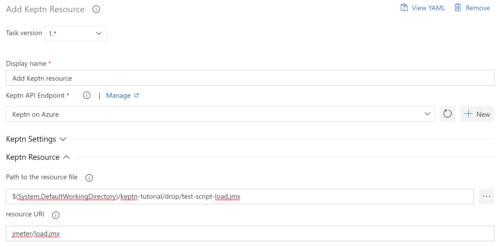

# Azure DevOps Keptn Integration

Integration of [Keptn][keptn_link] within your Azure DevOps pipelines. 

This extension includes 4 tasks which can be used to integrate your pipeline with the [Keptn][keptn_link] capabilities.
- Prepare [Keptn][keptn_link] environment
- Send [Keptn][keptn_link] event
- Wait for [Keptn][keptn_link] event
- Add [Keptn][keptn_link] resource

Watch the following Keptn Community Webinar to see the extension in action:

## Compatibility matrix

You can find out the latest release on the [VisualStudio Marketplace](https://marketplace.visualstudio.com/items?itemName=RealdolmenDevOps.keptn-integration).

This integration aims to be compatible with Keptn 0.9.x and 0.10.0. For more information, please take a look at [CHANGELOG.md](CHANGELOG.md).

## The service endpoint
First of all you need to configure the [Keptn][keptn_link] endpoint as a [`service connection`](https://docs.microsoft.com/en-us/azure/devops/pipelines/library/service-endpoints?view=azure-devops&tabs=yaml).

All you need to configure is the API endpoint and the token. Note that the api endpoint structure has changed from version 0.7 from keptn onwards.
> **Tip:** The API Token can be found in the Keptn bridge behind the user icon in the upper right corner.

## Prepare Keptn environment
This task is optional, but very usefull since it prepares a project, stage and service for you. It also puts these entities as variables on the pipeline for later use by the other tasks. Optionally you can also configure monitoring here and push an [sli and slo](https://keptn.sh/docs/concepts/quality_gates/) file to Keptn.

When you flag the Create/Initalize flag, you will see following in the keptn bridge if the project did not yet exist.

It's not in the screenshot, but there is also a section where you could configure monitoring via [Dynatrace][dynatrace_link] or [Prometheus][prometheus_link] and upload an sli and slo file. See https://keptn.sh/docs/0.8.x/quality_gates/ for more details on Service Level Indicators and Service Level Objectives.

This task also has options for the shipyard file required by the project. There are 3 types:
- `generated`: Which generates a simple shipyard which is enough for the quality-gate only use-case. You can always adapt this shipyard later on via the [Keptn][keptn_link] CLI.
- `inline`: A multiline textarea will appear allowing you to describe the yaml structure. Note that you could use placeholders for stage and whatever variables you want. This is default Azure Devops functionality.
- `file`: You then provide the path to the shipyard file which is available for the pipeline.
> **Note:** that the shipyard is only used once when creating the project. Any updates later on can be done via the [Keptn][keptn_link] CLI or any other means that [Keptn][keptn_link] provides.

## Send Keptn event
The main task in this extension.
- By sending the `configuration-changed` cloud-event to [Keptn][keptn_link], you can trigger [Keptn][keptn_link] to perform a deployment of an image. Note this event is deprecated, see 'delivery' event.
- By sending the `deployment-finished` cloud-event to [Keptn][keptn_link], you can trigger your load / performance tests to be executed. Note this event is deprecated, see 'delivery' event.
- By sending the `evaluation` triggered event to [Keptn][keptn_link], you can trigger Lighthouse to perform automatic validation of your performance tests.
- By sending the `delivery` triggered event to [Keptn][keptn_link], you can trigger a deployment and whatever you configured in keptn for the delivery sequence.
- You can also use the `generic` event send out any event you want. Just specify the entire body. You can use the azure-devops placeholders off course. Note that the entire body needs to be provided, including type and specversion. See [https://github.com/keptn-sandbox/keptn-azure-devops-extension/issues/34]

**configuration-changed** (deprecated) requires some extra parameters:
- `image`: the container image to be deployed

**deployment-finished** (deprecated) requires some extra parameters:
- `deploymentURI`: The public deploymentURI which will be used to execute the tests against
- `testStrategy`: The testing stategy which is used to perform the tests
- `image`: the container image to be deployed
- `tag`: The tag of the deployment

**evaluation** requires some extra parameters:
- `startTime`: format needs to be "yyyy-MM-ddTHH:mm:sszzz"
- `endTime`: format needs to be "yyyy-MM-ddTHH:mm:sszzz"
- `timeframe`: If you don't want to use start and end time you could for example provide "15m" as value to evaluate the previous 15 minutes.

**delivery** asks for some extra parameters:
- `sequence`: the sequence which is delivery by default
- `deploymentURI`: The local deploymentURI which will be used to execute the tests against
- `deploymentStrategy`: The deployment stategy
- `image`: the container image to be deployed

**generic** only asks for a:
- `body`: The entire JSON body of the event. Very flexible, all in your own hands.

All of the types above, except generic sinds you control it all, are sending labels to Keptn as well to provide extra context. The default labels are:
- buildId: $(Build.BuildNumber)
- definition: $(Release.DefinitionName)
- runby: $(Build.QueuedBy)
- environment : $(Environment.Name)
- pipeline : $(Release.ReleaseWebURL)
There is an optional text-area field called Labels where you can add a list of key-value pairs (example 'key:value' use semicolon) separated by a new line. You are able to extend or overwrite the default labels this way.

> **Note:** the start and end time for the evaluation probably will come via variables from a previous task running the load tests. If you enter it manually for some reason Azure DevOps changes the date format. Which is again not recognized by [Keptn][keptn_link].

## Wait for Keptn event
This task listens for some time for a specific [Keptn][keptn_link] event. It supports evaluation, delivery as wel as a generic event and you can provide your own sequence name. It waits for a configurable amount of minutes.
Prerequisite of this task is the Send [Keptn][keptn_link] Event task which puts the keptnContext as a variable on the pipeline. This task uses this variable to capture the result.

For evaluation you can configure what should happen with the pipeline on a warning or fail from keptn. In this case it will give a warning whenever the lighthouse service did not indicate a 'pass'. So both warning as fail in [Keptn][keptn_link] will result in a 'succeeded with issues' here.

The JSON string of the resulting event is published as variable "keptnEventData" so you can use it in whatever tasks you want later in the pipeline.

## Add Keptn resource
Although you can add the SLI, SLO and Dynatrace config files via the **Prepare Keptn Environment** task, there might be cases where you need to push additional files to Keptn. I am thinking about JMeter scripts for example or other config that can be used by Keptn services. That's when you could use this additional task.

## Features

A list of use-cases and features that this library supports is provided in [FEATURES.md](FEATURES.md).
## Development

Development Docs are available in [README_DEV](README_DEV.md).

## License and Credits

Initially created by `Bert Van der Heyden, Inetum-RealDolmen`.

Also available via the MarketPlace: https://marketplace.visualstudio.com/items?itemName=RealdolmenDevOps.keptn-integration

> Want to know more about our offering regarding [Dynatrace][dynatrace_link] and [Keptn][keptn_link]? Please contact us: https://www.realdolmen.com/en/solution/digital-performance-management
> Looking for official support for this plugin? See: https://www.realdolmen.com/en/solution/cicd-pipeline-quality-gates

[keptn_link]: https://keptn.sh
[dynatrace_link]: https://dynatrace.com
[prometheus_link]: https://prometheus.io
