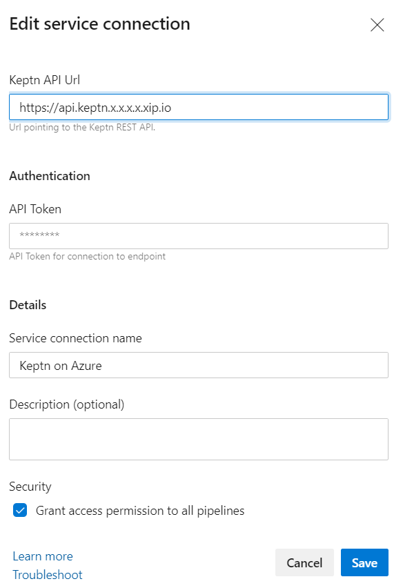
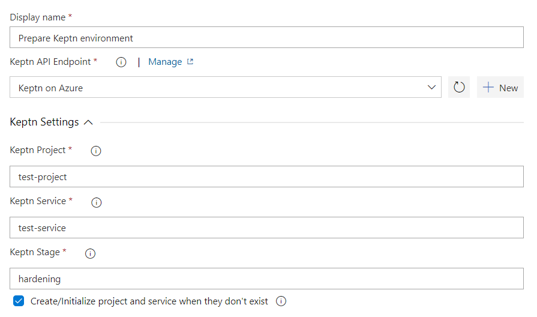
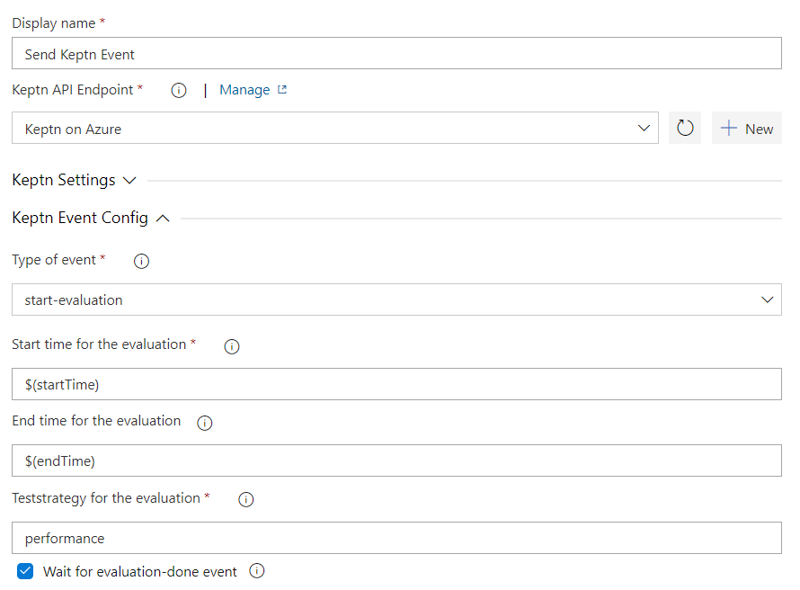
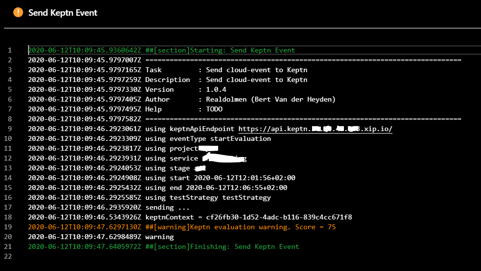
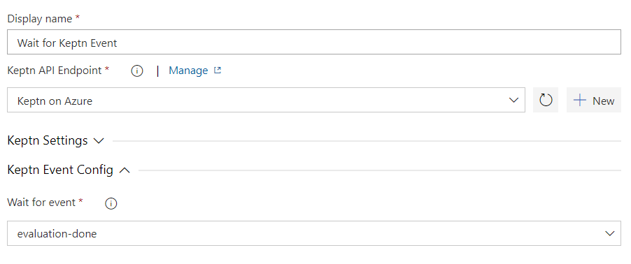
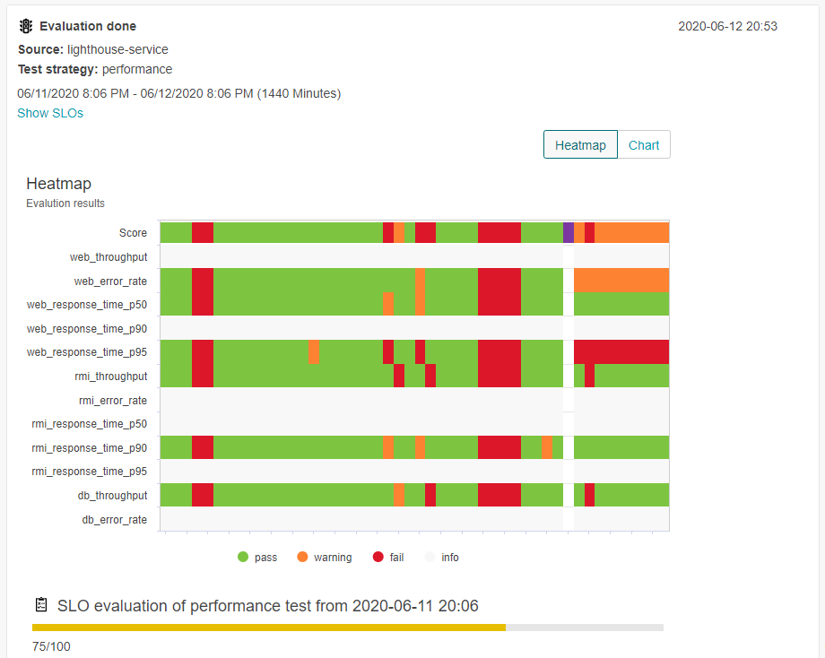

# Azure DevOps Keptn Integration

Integration of [Keptn][keptn_link] within your TFS/VSTS/AZDO build. 

This extension includes 3 tasks which can be used to integrate your pipeline with the [Keptn][keptn_link] capabilities.
- Prepare [Keptn][keptn_link] environment
- Send [Keptn][keptn_link] event
- Wait for [Keptn][keptn_link] event

Watch the following Keptn Community Webinar to see the extension in action:

## The service endpoint
First of all you need to configure the [Keptn][keptn_link] endpoint as a [`service connection`](https://docs.microsoft.com/en-us/azure/devops/pipelines/library/service-endpoints?view=azure-devops&tabs=yaml).

All you need to configure is the API endpoint and the token. Note that the api endpoint structure has changed from version 0.7 from keptn onwards.
> **Tip:** If you are using the keptn cli, they can be found in the $home/.keptn/.keptn file.

## Prepare Keptn environment
This task is optional, but very usefull since it prepares a project, stage and service for you. It also puts these entities as variables on the pipeline for later use by the other tasks. Optionally you can also configure monitoring here and push an [sli and slo](https://keptn.sh/docs/concepts/quality_gates/) file to Keptn.

When you flag the Create/Initalize flag, you will see following in the keptn bridge if the project did not yet exist.

It's not in the screenshot, but there is also a section where you could configure monitoring via [Dynatrace][dynatrace_link] or [Prometheus][prometheus_link] and upload an sli and slo file. See https://keptn.sh/docs/0.7.x/quality_gates/ for more details on Service Level Indicators and Service Level Objectives.

## Send Keptn event
The main task in this extension.
- By sending the `configuration-changed` cloud-event to [Keptn][keptn_link], you can trigger [Keptn][keptn_link] to perform a deployment of an image.
- By sending the `deployment-finished` cloud-event to [Keptn][keptn_link], you can trigger your load / performance tests to be executed.
- By sending the `start-evaluation` cloud-event to [Keptn][keptn_link], you can trigger Lighthouse to perform automatic validation of your performance tests.

configuration-changed requires some extra parameters:
- `image`: the container image to be deployed

deployment-finished requires some extra parameters:
- `deploymentURI`: The public deploymentURI which will be used to execute the tests against
- `testStrategy`: The testing stategy which is used to perform the tests
- `image`: the container image to be deployed
- `tag`: The tag of the deployment

start-evaluation requires some extra parameters:
- `startTime`: format needs to be "yyyy-MM-ddTHH:mm:sszzz"
- `endTime`: format needs to be "yyyy-MM-ddTHH:mm:sszzz"
- `strategy`: by default performance

> **Note:** the start and end time for the evaluation probably will come via variables from a previous task running the load tests. If you enter it manually for some reason Azure DevOps changes the date format. Which is again not recognized by [Keptn][keptn_link].

Note that you can just flag "wait for evaluation done" when you want to wait for the evaluation and pass / fail accordingly. See next task for more details

## Wait for Keptn event
This task listens for some time for a specific [Keptn][keptn_link] event. Currently only evaluation-done is supported. It waits for a configurable amount of minutes.
Prerequisite of this task is the Send [Keptn][keptn_link] Event task which puts the keptnContext as a variable on the pipeline. This task uses this variable to capture the result.

You can configure what should happen with the pipeline on a warning or fail from keptn. In this case it will give a warning whenever the lighthouse service did not indicate a 'pass'. So both warning as fail in [Keptn][keptn_link] will result in a 'succeeded with issues' here.

## Release notes ##
* **0.1.4**
First public version
* **0.1.5**
Added SLI and SLO upload
* **0.1.14**
Github tickets 16, 14, 2, 7, 17, 18, 8, 19, 10
* **0.1.15**
Added support for the deployment-finished event
* **0.1.17**
Github ticket 32: some changes to support keptn 0.7 and higher
Updated README.md
* **1.0.0**
Github ticket 6 beïng implementation of the configuration changed event
Updated README.md
* **1.0.5**
Github ticket 30: added support to upload dynatrace.conf file.
Added support for timeframe in the StartEvaluation event. Available since Keptn 0.7.3.
Updated README.md
* **1.0.8**
Added support for custom labels
Added separate task to upload resources to Keptn
Updated README.md

Created by `Bert Van der Heyden, RealDolmen - an Inetum company`.
Also available via the MarketPlace: https://marketplace.visualstudio.com/items?itemName=RealdolmenDevOps.keptn-integration
> Want to know more about our offering regarding [Dynatrace][dynatrace_link] and [Keptn][keptn_link]? Please contact us: https://www.realdolmen.com/en/solution/digital-performance-management
> Looking for official support for this plugin? See: https://www.realdolmen.com/en/solution/cicd-pipeline-quality-gates

[keptn_link]: https://keptn.sh
[dynatrace_link]: https://dynatrace.com
[prometheus_link]: https://prometheus.io